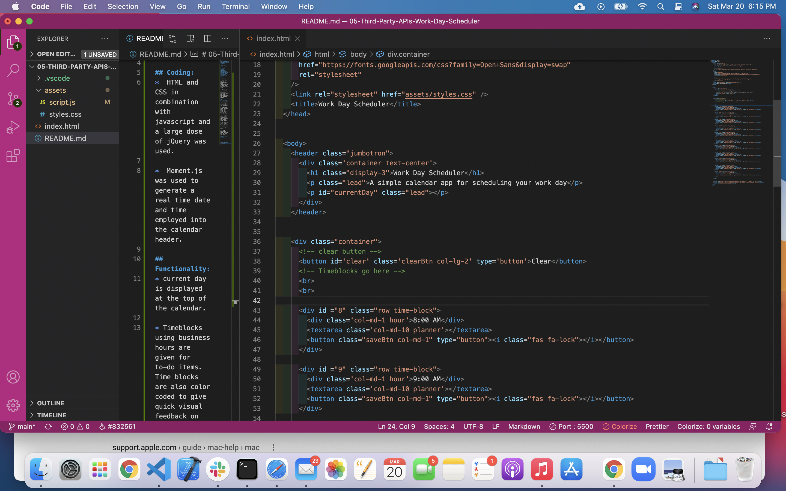
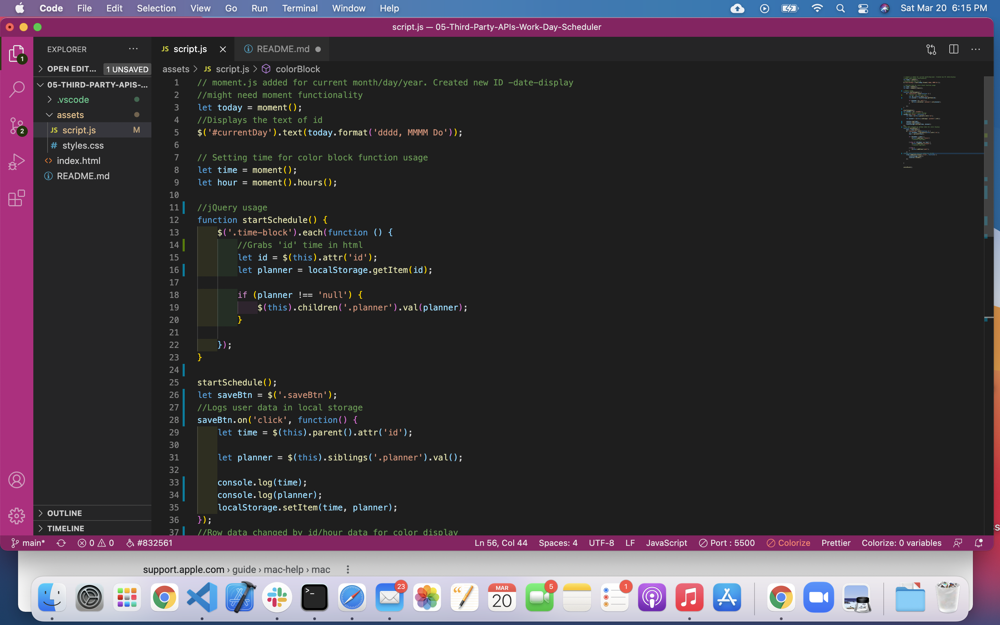
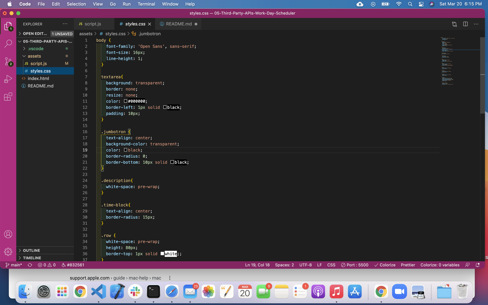

# 05-Third-Party-APIs-Work-Day-Scheduler

## The task given was to create a simple calendar application that allows a user to save events for each hour of the day. 

## Coding:
*  HTML and CSS in combination with javascript and a large dose of jQuery was used.

*  Moment.js was used to generate a real time date and time employed into the calendar header.

## Functionality:
* current day is displayed at the top of the calendar.

* Timeblocks using business hours are given for to-do items.  Time blocks are also color coded to give quick visual feedback on past, present and future items to-do.

* The data is saved within local storage, even upon refreshing the page.  

* A clear button was added to clear out the form and reuse.

## Deployed Website:

## Screenshot:
;
;
;
;